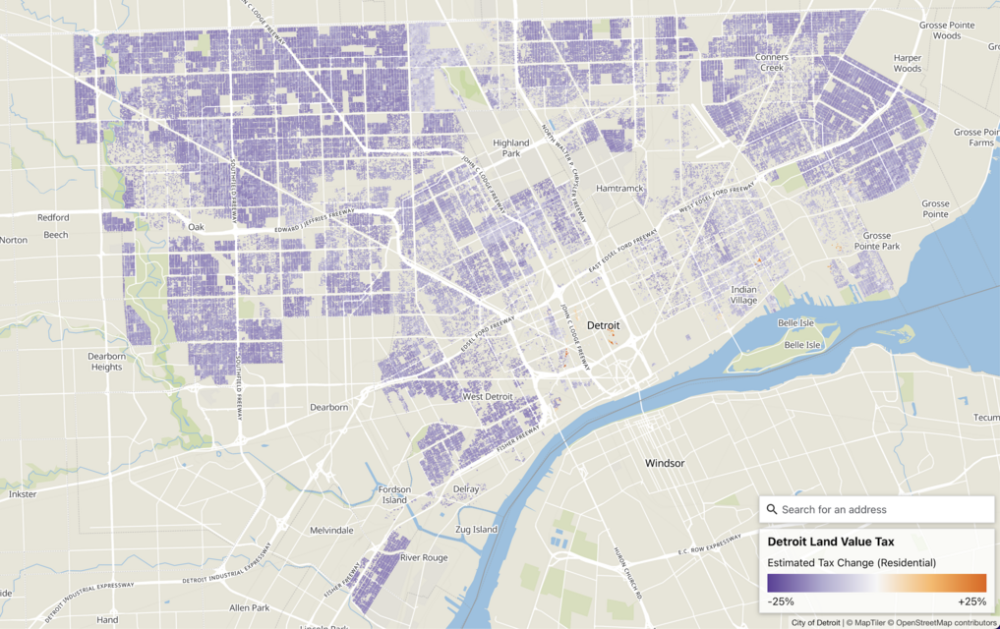

# Detroit Land Value Tax Maps

Mapping data released around the Detroit Land Value Tax Plan. Current data from the city only exists for residential parcels.



## Download the Data

- [detroit-lvt.csv](https://detroit-land-value-tax-maps.us-east-1.linodeobjects.com/data/detroit-lvt.csv): Parcel PINs with current and proposed assessment information
- [parcels.geojson](https://detroit-land-value-tax-maps.us-east-1.linodeobjects.com/data/parcels.geojson): Parcel geography data with other fields included

## Setup

To build the data you'll need [`mapshaper`](https://github.com/mbloch/mapshaper), [`pyesridump`](https://github.com/openaddresses/pyesridump), and [`tippecanoe`](https://github.com/felt/tippecanoe) installed.

```sh
make all
```

You'll need NPM installed to build and run the map with:

```sh
npm install
npm start
```
